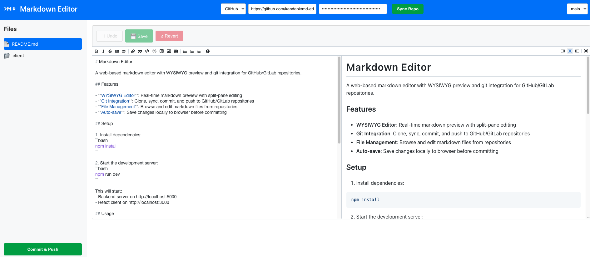

# Markdown Editor

A web-based markdown editor with WYSIWYG preview and git integration for GitHub/GitLab repositories.



## Features

- **WYSIWYG Editor**: Real-time markdown preview with split-pane editing
- **Git Integration**: Clone, sync, commit, and push to GitHub/GitLab repositories
- **File Management**: 
  - Browse and edit markdown files from repositories
  - Create new markdown files
  - Create folders to organize files
  - Upload images
  - Delete files
  - Right-click context menu for quick actions
- **Auto-save**: Save changes locally to browser before committing

## Setup

1. Install dependencies:
```bash
npm install
```

2. Start the development server:
```bash
npm run dev
```

This will start:
- Backend server on http://localhost:5000
- React client on http://localhost:3000

## Usage

1. **Connect Repository**: Enter your GitHub/GitLab repository URL
2. **Authentication**: Add access token for private repositories
3. **Sync**: Click "Sync Repo" to clone/pull the repository
4. **Edit**: Select markdown files from the sidebar to edit
5. **Save**: Use "Save" to save changes to the server
6. **Commit**: Use "Commit & Push" to push changes to the repository

## API Endpoints

- `POST /api/repo/sync` - Clone or pull repository
- `GET /api/files/:repo` - List markdown and image files
- `GET /api/file/:repo/*` - Read file content
- `PUT /api/file/:repo/*` - Save file content
- `POST /api/file/:repo/*` - Create new file
- `DELETE /api/file/:repo/*` - Delete file
- `POST /api/folder/:repo/*` - Create new folder
- `POST /api/upload/:repo/*` - Upload image file
- `POST /api/repo/:repo/commit` - Commit and push changes

## Tech Stack

- **Frontend**: React, TypeScript, @uiw/react-md-editor
- **Backend**: Node.js, Express, simple-git
- **Storage**: Local file system with git repositories

## Author
Abhi